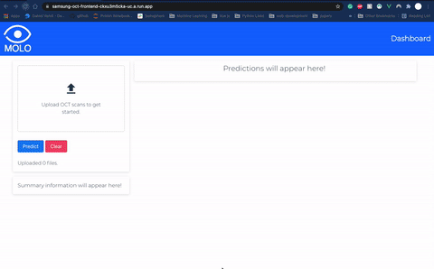

# Detecting Ocular Myopathy with Deep Learning from OCT Patient Scans


[](https://www.python.org/downloads/release/python-380/)


## About
In this repo you will find the source code, along with EDA notebooks and some (but not all) models used to create the `Molo` application for detecting ocular myopathies from OCT scans.

Authors: Kevin De Jesus, Janhavi Giri and Daniel Varoli

## Overview
The full app is split into 3 services:

* The frontend
* The backend (called molo). 
* Tensorflow Serving (Available only when running with Docker-compose) and is predominately used in development.

Currently, the production version of this application is hosted on GCP Cloud Run and can be found at [here](https://samsung-oct-frontend-ckxu3m5cka-uc.a.run.app/)
There are two models that can be used in production, either the full model and the TF Lite model, which is the quantized
version of the full model and occupies 10x less space in memory.

## Demo
A quick demo of what the app looks like at the moment. To run that locally for you, just follow the instructions
further down.



## Running Locally

### Prerequisites

In order to be able to properly run the full application locally, a couple of files need to be created.

1) A .
The good news is is that this repo comes with a `docker-compose` file, which you can use to run the entire app on any machine with Docker installed.
(To install Docker click [here](https://docs.docker.com/get-docker/)

Once you have Docker installed, clone this repo 

```bash
mkdir samsung_oct && git clone https://github.com/djvaroli/samsung_oct.git samsung_oct/
```

Navigate to the root directory of the repo. 

```bash
cd samsung_oct/
```

Boot up the two services with `docker-compose`
```bash
docker-compose up --build
```

You should now be able to access the `molo` service at `localhost:8000` and the frontend service at `localhost:80`. 
To make sure things are working, navigate to `localhost:8000` and you should see a welcome message.

## Set-up with Python Venv
Clone this repository to your local machine
```bash
mkdir samsung_oct && git clone https://github.com/djvaroli/samsung_oct.git samsung_oct/
```

Create a python virtual environment and activate it
```bash
python3 -m venv venv && source venv/bin/activate
```

Install all the necessary dependencies
```bash
pip3 install -r requirements.txt
pip3 install -e utilities/ # this will install the  custom utility functions
```

You should now be set to run/modify code in this repository. 
